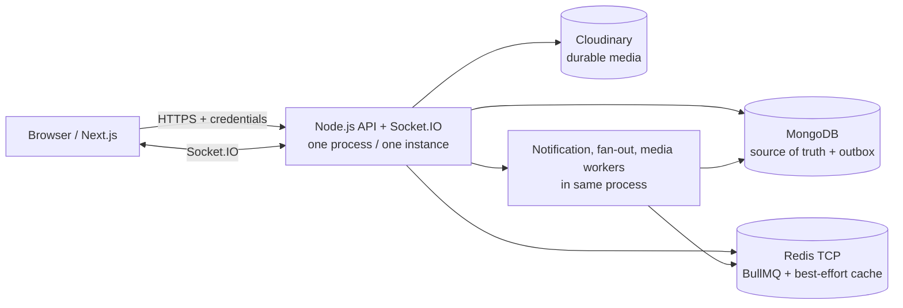

# X-ver2 backend

Node.js/TypeScript backend cho X Clone portfolio deployment. MongoDB giữ dữ liệu bền và transactional outbox; Redis phục vụ BullMQ, presence/cache best-effort; Cloudinary giữ media bền. Bản portfolio chạy một API process có HTTP, Socket.IO và worker cùng process, không tự nhận production-ready.

## Demo

**URL sẽ được điền sau Phase 8.** Contract dự kiến:

- Frontend: `https://x.cacbonat.top`
- Backend API/Socket.IO: `https://api.x.cacbonat.top`
- API docs: `https://api.x.cacbonat.top/api-docs`

DNS, HTTPS, provider URL và runtime production hiện là **NOT VERIFIED**. Không có placeholder nào được coi là deployment đang hoạt động.

## Kiến trúc portfolio



MongoDB deployment phải hỗ trợ multi-document transaction vì business flow dùng `withTransaction()`. Portfolio dùng `SOCKET_ADAPTER_MODE=memory`, nên một instance là invariant; không có Redis emitter/process-role code trong release này.

## Chạy local

Yêu cầu Node.js 22, MongoDB có transaction, Redis TCP và Cloudinary credential cho media.

```powershell
Copy-Item .env.example .env
docker compose up -d redis
npm ci
npm run build
npm run start:dev
```

Trên macOS/Linux dùng `cp .env.example .env`. Redis Compose bind riêng `127.0.0.1:6379`, bật AOF `everysec`, `noeviction`, volume local và healthcheck; file này không dành cho Render production.

Startup kết nối MongoDB, tạo index, kết nối Redis cache/BullMQ rồi mới listen. API docs đọc `./swagger.yaml`, nên Docker runtime cố định working directory `/app` và copy file này.

## Env contract

Không commit `.env`, URI, password, token hoặc credential. `.env.example` là contract local không chứa giá trị thật.

| Nhóm | Biến | Production |
| --- | --- | --- |
| App | `PORT` | Render cấp runtime; app bind trên port này |
| Proxy/CORS | `TRUST_PROXY_HOPS`, `CORS_ORIGIN` | `1`; target exact `https://x.cacbonat.top` |
| MongoDB | `MONGODB_URI` hoặc `DB_CLUSTER_HOST` + `DB_USERNAME` + `DB_PASSWORD`; `DB_NAME` | Local có thể dùng URI; Blueprint portfolio dùng bộ ba `DB_*` và database `Clone-X-ver2` |
| Redis | `REDIS_URL` | Redis TCP URI là secret |
| Redis optional | `REDIS_CACHE_URL`, `REDIS_QUEUE_URL`, `REDIS_SOCKET_URL` | Để trống/không set thì fallback `REDIS_URL` |
| Auth | `JWT_SECRET_ACCESS_TOKEN`, `JWT_SECRET_REFRESH_TOKEN` | Hai secret độc lập |
| Token TTL | `ACCESS_TOKEN_EXPIRES_IN`, `REFRESH_TOKEN_EXPIRES_IN` | `15m`, `7d` |
| Cloudinary | `CLOUDINARY_CLOUD_NAME`, `CLOUDINARY_API_KEY`, `CLOUDINARY_API_SECRET` | Nhập trong provider secret manager |
| Runtime mode | `SOCKET_ADAPTER_MODE`, `MEDIA_PROCESSING_MODE`, `CONVERSATION_MESSAGE_CACHE_MODE` | `memory`, `inline`, `off` |
| Queue | `MEDIA_WORKER_CONCURRENCY`, `MEDIA_QUEUE_MAX_ATTEMPTS` | `1`, `5` |
| Retention | `QUEUE_COMPLETED_RETENTION_COUNT`, `QUEUE_FAILED_RETENTION_COUNT` | `300`, `500` |
| Upload | `MAX_IMAGE_UPLOAD_MB`, `MAX_VIDEO_UPLOAD_MB`, `MAX_AUDIO_UPLOAD_MB` | `10`, `20`, `10` |
| Notification | `NOTIFICATION_*_ENABLED` | Các flag trong `render.yaml` bật |

Collection override và toàn bộ default có trong `.env.example`. `CORS_ORIGIN` chấp nhận CSV cho local, nhưng deployment portfolio phải dùng exact origin, không dùng `*` với credentials.

## Redis và runtime modes

| Capability | Portfolio | Hành vi |
| --- | --- | --- |
| Socket.IO | `memory` | Không mở Redis pub/sub; chỉ đúng với một API instance. |
| Media | `inline` | Upload Cloudinary durable rồi hoàn tất metadata trong request. |
| Message cache | `off` | Đọc message từ MongoDB, không ghi full message payload vào Redis. |
| Notification outbox | `true` | Publisher/worker cùng process; MongoDB outbox cho phép retry backlog. |

`redis://` và `rediss://` đều được parser hỗ trợ; scheme thật phải lấy từ provider Connect wizard. Version/protocol/TLS/persistence/HA/backup/quota/region là dữ liệu dashboard Phase 8, hiện **NOT VERIFIED**. Không mô tả Redis queue là durable production storage: MongoDB/outbox và durable media record là nguồn phục hồi.

Queue dùng exponential backoff và env-driven count retention. Presence, last-seen và friend-ID cache là best-effort. Trước public release phải đo connection/ops/memory thực tế thay vì dùng connection budget trong source như evidence.

## Media durable source và reconciliation

- `inline`: Cloudinary upload + MongoDB metadata hoàn tất trước response `ready`.
- `queue`: response `pending`; job chỉ mang media ID/durable Cloudinary reference, không mang local filepath.
- Nếu enqueue lỗi, record `pending` vẫn tồn tại và reconciler tạo deterministic missing job.
- File multipart trong `uploads/...` chỉ là temp ephemeral và được cleanup trong `finally`.
- Nếu queue mode lỗi khi vận hành, chuyển về `inline` sau khi xử lý/reconcile pending record; không xóa Redis/Mongo tùy tiện.

## Notification và realtime

```text
business transaction
→ typed domain event + transactional outbox
→ BullMQ worker
→ policy + repository transaction
→ in-process RealtimeEmitter after commit
```

`NotificationState`, `ConversationReadState` và `UserMessageState` là nguồn REST cho unread reconciliation. `NOTIFICATION_OUTBOX_ENABLED=false` có thể pause publisher/worker mà không xóa pending outbox. Frontend refetch state sau Socket.IO reconnect.

## Auth scope

Self-registration auto-verifies user và cho phép login ngay. Email verification, forgot/reset password và email recovery không được deploy; không tạo email provider/dummy secret. Refresh/access token hiện vẫn là client-readable cookie contract, là technical debt được ghi nhận thay vì mô tả như auth production hoàn chỉnh.

## Health, Docker và kiểm tra release

- `GET /health/live`: liveness không ping dependency.
- `GET /health/ready`: ping MongoDB, Redis cache và BullMQ Redis với timeout; trả `503` nếu dependency chưa sẵn sàng.
- Health routes đứng trước global rate limiter.
- `GET /api-docs`: Swagger UI từ runtime `swagger.yaml`.

```bash
npx tsc --noEmit
npm run build
npm run lint
docker compose config
docker compose up -d redis
docker compose ps
docker build -t clone-x-api:phase7 .
docker run --rm --env-file .env.docker.local -p 4000:4000 clone-x-api:phase7
```

Tạo `.env.docker.local` từ `.env` (file này đã bị ignore) và đổi hostname dependency chạy trên host sang `host.docker.internal`; không commit hoặc gửi nội dung file. Docker image multi-stage dùng Node 22 Debian slim, cài production dependency riêng, chạy `USER node` và chỉ chứa `dist`, production dependencies, package manifests, Swagger cùng writable temp upload directories. Không mount persistent volume cho upload.

## Deploy và rollback

Xem [DEPLOYMENT.md](./DEPLOYMENT.md) cho thứ tự MongoDB → Redis → Cloudinary → Render → backend custom domain → Vercel → frontend custom domain, env matrix, evidence cần thu và rollback.

- Render dùng repository backend riêng; Root Directory là `.` hoặc trống, không phải `X-ver2`.
- `render.yaml` dùng Dockerfile root, `/health/ready`, một instance và không override Docker `CMD`.
- Native Node fallback chỉ dùng khi có Docker blocker đã xác minh: build `npm ci && npm run build`, start `npm run start:prod`, giữ nguyên health/env contract.
- Runtime rollback ưu tiên deployment/image trước có env contract tương thích; capability rollback dùng `memory + inline + off`, không khôi phục queue filepath hay full message cache trên transport không phù hợp.

## Known limitations trước deployment

- Một backend instance; không hỗ trợ split-worker/multi-instance realtime.
- Filesystem upload là ephemeral temp, không phải persistent storage.
- Free-tier sleep/cold-start có thể ngắt socket và dừng worker tạm thời; hành vi/quãng thời gian thật phải đo Phase 8.
- Redis loss có thể mất queue/cache best-effort; recovery dựa trên MongoDB/outbox/media pending, không bảo đảm exactly-once toàn hệ thống.
- Provider tier/quota/TLS/persistence/HA/backup và custom domain/HTTPS đều **NOT VERIFIED** cho tới deployment thật.
- Một số backend endpoint chưa có frontend UI; đây không phải blocker cho các luồng P0 đã chốt.
